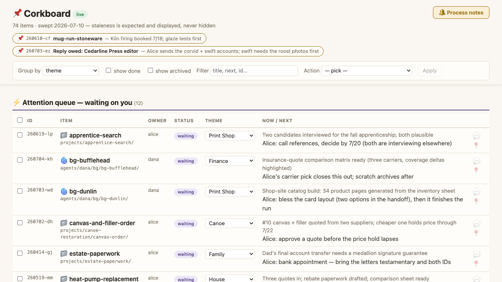

# 📌 Corkboard

**One surface for everything you and your AI desk agent are running — with a paper trail for every note you leave.**

Corkboard is a pattern first and software second. The pattern: a human principal and an AI desk agent share an estate — projects, background agent runs, standing obligations — and need one board where all of it is visible, plus a trustworthy way for the human's one-line reactions ("archive this", "pick the middle quote", "brief me on this") to turn into real work. The software: a single self-contained HTML page and a ~180-line Python stdlib server, small enough to read over coffee.

The board is a **view and a routing surface, not a source of truth**. Canonical state stays in your own files — status docs, handoff notes, task lists. The desk agent is the transmission: it *sweeps* ground truth onto the board, and *drains* your queued notes back out into real work, archiving every consumed note with a one-line disposition saying what was done. Nothing is silently dropped; nothing updates itself without a narrator.



## Quickstart

```
git clone <this repo>
cd corkboard
./corkboard-serve
```

Open http://localhost:2675 — you'll see a fully populated sample board for a fictional principal (Alice, who is writing a field guide to urban birds, restoring a cedar-strip canoe, and running a small lettering shop) and her two desk agents, Iris and Dana. Two of Alice's notes are still queued in the inbox, so you can see the drain lifecycle mid-flight.

No server handy? Just open `board.html` in a browser — it carries an embedded copy of the registry and degrades to a read-only board.

To adopt it for real: replace the sample `board.json` with your own registry (your desk agent seeds it at the first sweep), empty the two inbox files, and hand `PROCEDURES.md` to your agent.

Requires Python 3. No dependencies, no build step, no accounts.

## What's in the box

| File | What it is |
|---|---|
| `PATTERN.md` | The pattern, documented: tracking IDs, the view-not-truth principle, the feedback lifecycle, why a human-legible agent stays in the loop |
| `WISHLIST.md` | Ideas we like but haven't built (first up: serverless mode via the File System Access API) |
| `PROCEDURES.md` | The two operating procedures for the desk agent: **drain** (consume the principal's notes) and **sweep** (refresh the board from ground truth) |
| `corkboard-serve` | Single-file Python 3 stdlib server; also `./corkboard-serve render` to re-embed the registry into the static page |
| `board.html` | The board UI — one self-contained page; live with the server, read-only without it |
| `board.json` | The registry: themes, sweep date, and one entry per item (sample data included) |
| `inbox.jsonl` | Queued events — feedback notes and bulk actions awaiting the desk agent's drain |
| `inbox-archive.jsonl` | The audit trail: every consumed event plus a one-line disposition of what was done |

## The shape of an item

Every project, background run, and thread gets an immutable tracking ID (`yymmdd-aa` — founding date plus two random letters), a theme, a status, and a transient feedback slot. The attention queue — everything with status `waiting` — sits at the top of the board, because the most useful question a board can answer is *"what's blocked on me?"*

Start with `PATTERN.md` for the design, `PROCEDURES.md` for the day-to-day.

## License

MIT — see `LICENSE`.
